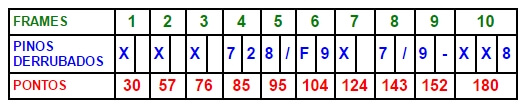

# PROGRAMA EM HASKEL DE CONTAGEM DE PONTOS NUM JOGO DE BOLICHE

Programa que lê a quantidade de pinos derrubados por um praticante de boliche em cada jogada e imprime: A sequência de pinos derrubados (de acordo com os exemplos de entrada e saída e as anotações de contagem de pontos - https://boliche.com.br/esporte-boliche/contagem-dos-pontos-no-boliche/) e a pontuação final do jogador.

Dica: Para testar seu programa, sugere-se utilizar o seguinte simulador de pontos: https://www.bowlinggenius.com/

# COMO É A PONTUAÇÃO NO BOLICHE?

A fórmula da CONTAGEM DE PONTOS NO BOLICHE tem as seguintes variáveis:

Os pontos são a soma dos pinos derrubados.
Exceto quando fizer Strike (derrubar 10 pinos na 1.ª bola)
ou Spare (derrubar 10 pinos nas duas bolas jogadas)
Se fizer Strike ganha bônus nas 2 bolas jogadas a seguir,
Se fizer Spare ganha bônus na próxima bola jogada.
O bônus é igual ao número de pinos derrubados.
O total de 1 partida pode variar de zero a 300 pontos.
Aprenda como é a contagem dos pontos no Boliche, que é baseada nos pinos derrubados.

A pontuação de uma partida ou linha varia de acordo com a quantidade de pinos e o momento que o jogador os derruba.

A pontuação pode ir de zero (quando nenhum pino é derrubado nas dez jogadas ou “frames”) até o máximo possível de 300 pontos, ou seja, 12 “strikes” consecutivos.

Supostamente, como cada partida tem 10 “frames” (jogadas), só seriam possíveis 10 “strikes”.

Porém, se o jogador derrubar todos os pinos no primeiro arremesso do 10.º “frame”, tem o direito de jogar mais duas bolas, podendo completar 12 “strikes” numa mesma linha.

## LINHA DE FALTA NA PONTUAÇÃO DO BOLICHE
Toda pista possui uma Linha de Falta com mais ou menos 3 cm e na largura da pista, localizada entre o término do “approach” e o início da pista.

Se o jogador pisar nesta linha, ao fazer o seu arremesso, perderá a jogada.

Existem Linhas de Falta com sensores eletrônicos que detectam a falta através de células foto-elétricas e aplicam a penalidade automaticamente ao infrator.

Em alguns centros de boliche o monitor automaticamente anota zero ponto ( – ) e, se for o primeiro arremesso, serão colocados novamente os dez pinos.

Dessa forma, caso o jogador derrube os dez pinos nessa segunda jogada após a falta, será computado um “spare”.

Se a falta for na segunda jogada, não marcará pontos nessa, valendo apenas os pinos derrubados na primeira jogada.

## ANOTAÇÃO DA CONTAGEM DOS PONTOS NO BOLICHE
A anotação da contagem dos pontos no Boliche ocorre conforme o número de pinos derrubados.

Exceto quando for strike ou spare, pois nesse caso há bônus (conforme explicação a seguir).

O número de pinos derrubados no primeiro lançamento do jogador deverá ser marcado no canto superior esquerdo do quadrado correspondente a cada frame.

O número de pinos derrubados no seu segundo lançamento deverá ser marcado no canto superior direito do quadrado correspondente àquele mesmo frame.

Se nenhum pino for derrubado na segunda bola, o espaço referente àquele lançamento deverá ser preenchido com (-). A anotação dos dois lançamentos deverá ser feita imediatamente.

### EXEMPLO DE CONTAGEM DE PONTOS NO BOLICHE:

No primeiro frame o jogador do exemplo derrubou os 10 pinos na primeira bola jogada (strike).
Porém para marcar esses dez pontos do primeiro frame, antes é preciso jogar as duas bolas seguintes.
Dessa forma pode-se somar o bônus pelo strike, que são os pinos derrubados nas 2 BOLAS seguintes.

### Por que 30 pontos no primeiro frame?
São 10 pontos pelo strike
+ bônus das 2 BOLAS jogadas na seqüência por esse strike (10 + 10)
Esse bônus é porque o jogador fez dois strikes nas duas bolas seguintes.
Então acumula o máximo de 30 pontos em um só frame.

### Por que 57 pontos no segundo frame?
São os 30 pontos acumulados do primeiro frame (veja acima)
+ os 10 pontos pelo strike que fez neste segundo frame
+ bônus das 2 BOLAS jogadas na seqüência por esse strike,
Observe que na primeira jogada o jogador fez outro strike e na segunda derrubou apenas 7 pinos.

Então: 30 + 10 + 10 + 7 é igual a 57 pontos (total até o segundo frame.

### Por que 76 pontos no terceiro frame?
São os 57 pontos acumulados até o segundo frame
+ os 10 pontos pelo strike que fez neste terceiro frame
+ bônus das 2 BOLAS jogadas na seqüência por esse strike,

Observe que na primeira o jogador derrubou 7 pinos e na segunda apenas 2.
Então temos: 57 + 10 + 7 + 2 = 76

### Por que 85 pontos no quarto frame?
São os 76 pontos acumulados até o terceiro frame
+ os 9 pontos (7+2) conseguidos nesse frame.
Não tem bônus porque não fez strike nem spare.
Então temos: 76 + 9 = 85

### Por que 95 pontos no quinto frame?
São os 85 pontos acumulados até o quarto frame
+ os 10 pontos (spare 8+2) conseguidos nesse frame
+ o bônus da BOLA SEGUINTE por esse spare
(que é zero, porque o jogador cometeu falta e não marca ponto).
Então temos: 85 + 10 + 0 = 95

### Por que 104 pontos no sexto frame?
São os 95 pontos acumulados até o quinto frame
+ os 9 pontos conseguidos nesse frame (0 + 9).
Não tem bônus porque não fez strike nem spare.

Então temos 95 + 0 + 9 = 104

## Por que 124 pontos no sétimo frame?
São os 104 pontos acumulados até o sexto frame
+ os 10 pontos pelo strike conseguido nesse frame
+ bônus das 2 BOLAS jogadas na seqüência por esse strike
Observe que na primeira jogada o jogador derrubou 7 pinos e na segunda 3 pinos.
Então temos 104 + 10 + 7 + 3 = 124

### Por que 143 pontos no oitavo frame?
São os 124 pontos acumulados até o sétimo frame
+ os 10 pontos pelo spare conseguido nesse frame
+ o bônus da BOLA SEGUINTE por esse spare (o jogador derrubou 9 pinos).
Então temos: 124 + 10 + 9 = 143

### Por que 152 pontos no nono frame?
São os 143 pontos acumulados até o oitavo frame
+ os 9 pinos derrubados nesse frame.
Não tem bônus porque não fez strike nem spare.
Então temos: 143 + 9 = 152

### Por que 180 pontos no frame final (o décimo)?
São os 152 pontos acumulados até o nono frame
+ 10 pontos pelo strike na primeira bola jogada nesse frame
+ bônus das 2 BOLAS seguintes (outro strike e 8 pinos).
Então temos: 152 + 10 + 10 + 8 = 180

### Observação:
Se o jogador fizer strike na primeira bola jogada no décimo frame ganha-se 2 bolas extras para jogar como bônus.

Se o jogador fizer spare nas duas primeira bolas jogadas no décimo frame ganha UMA bola extra para jogar como bônus.